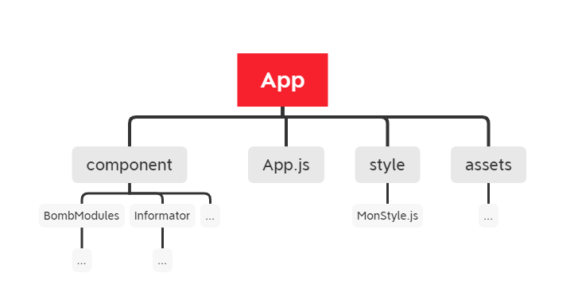

- [Info701_Projet](#info701_projet)
- [1. Choix technologiques](#1-choix-technologiques)
- [2. Architecture](#2-architecture)
- [3. Fonctionnement de l'app](#3-fonctionnement-de-lapp)
- [4. Installation](#4-installation)
- [5. Diffucultés rencontrées](#5-diffucultés-rencontrées)

# Info701_Projet

Preuve de concept du jeu Keep Talking And Nobody Explode.
Le joueur ayant le role informateur devra apporter les informations nécéssaires au désamorçage de la bombe.
Le joueur ayant le role désamorceur devra décrire les modules à l'informateur et suivre ses directives pour désamorcer la bombe.

# 1. Choix technologiques
 Utilisation de react-native accompagné d'un serveur Node.js.
 Communication entre react-native et le serveur via socket.io
 
# 2. Architecture
- Diagramme architecture 
 
 
   
# 3. Fonctionnement de l'app 

 
 
 - Lancement de l'app -> Home.tsx
 - Choix des roles -> RoleSelection.tsx
 - En attente de joueur -> Connection.tsx (Une fois le joueur trouvé jeu se lance, sinon jouez "seul" en cliquant sur "Afficher jeu")
 - Affichage du jeu (dépend du role choisi) -> Bombe.tsx | informator/informatorLayout.tsx
 
# 4. Installation

Cloner le repo

 - Coté serveur
   - Positionnez vous dans le dossier Server.  
   - Executez la commande : *node .\index.js*  
    
- Coté application : 
    - Mettre à jours Connection.tsx :
        Ouvrez Connection.tsx  
        Remplacez l'adresse ip de la création de socket par l'adresse ip de votre serveur. (ligne 21)  
    - Lancer avec expo :
        Placez vous dans le dossier my-app  
        Executez la commande : expo start  

# 5. Diffucultés rencontrées

 - Ajout du vocal :   
    WebRtc dispo mais toujours sur la techno React ~ Navigateur, d'autres moyens disponnibles mais avec adhésion à des abonnements.  
    Essaie de mise en place à la main avec socket.io n'a rien donné de très concluant.
 
 - Construire un affichage satisfaisant :  
    Ici c'est une preuve de concept ce n'est pas très important, mais le mieux pour un bon affichage serait une implémentation en natif (pour de la 3D aussi par exemple).

 - Gestion de plusieurs groupes de joueurs en parallèle par le serveur:  
    Créer des "room" socket io pour chaque duo de joueurs.  
    A cause de soucis de déconnexions de socket je n'ai pas réussi à l'implémenter de façon convenable, j'ai donc opté pour quelque chose de fonctionnel avec seulement deux    joueurs.
